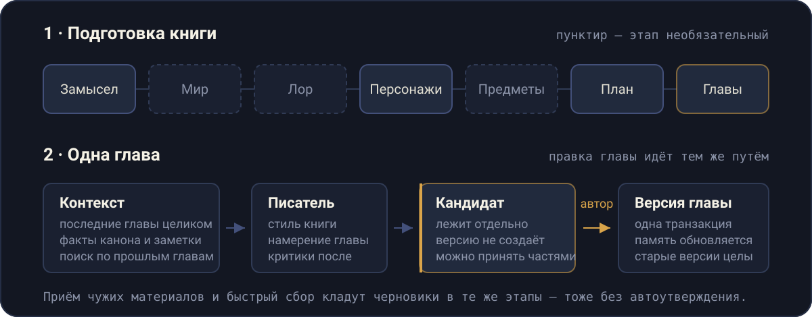

<p align="center">
  
</p>

Book Forge — инструмент для написания романа с помощью LLM. Работает на своей машине, с одним автором и одним файлом SQLite. Русский язык, десктоп.

Главное правило: **без автора в книгу ничего не попадает**. Модель готовит черновики этапов и куски прозы, но каждый из них остаётся кандидатом, пока автор не нажмёт «Принять».

## Как это устроено

<p align="center">
  
</p>

**Мастерская** ведёт книгу по семи этапам. Книга заводится одним полем «Замысел»; дальше агент предлагает 3–5 питчей, автор собирает из них один и утверждает — это и есть концепция. Мир, лор и предметы необязательны: роман можно закончить без них, и интерфейс говорит это вслух.

**Глава** пишется не из пустоты. В запрос уходят последние три главы целиком, свёртка всего, что раньше, факты канона со сроком жизни, эпизодические заметки и результат гибридного поиска по прошлым главам. Готовый текст ложится в `prose_proposals` — отдельно от главы. Автор принимает его целиком или по абзацам; версия создаётся одной транзакцией вместе с обновлением памяти.

**Свои материалы** можно перетащить в книгу: `.md`, `.txt`, `.docx`. Классификатор режет каждый файл на фрагменты и раскладывает их по этапам — мир, персонажи, оглавление, готовые главы. Всё приземляется черновиками в статусе «на рассмотрении», ничего не утверждается само.

**Быстрый сбор** одной кнопкой готовит черновики мира, лора, персонажей, предметов и плана — по этапу за раз, с возможностью остановить.

## Чем отличается

- **Кандидат вместо коммита.** Генерация и правка главы не трогают ни текущую версию, ни память, ни черновик автора. Принятие сверяется с ожиданиями клиента и отвечает 409, если под руками что-то изменилось.
- **Память книги, а не длинный промпт.** Скользящее окно + свёртки + временны́е факты канона (`valid_from` / `valid_to_chapter`) + заметки в `sqlite-vec`. Длина книги не раздувает запрос.
- **Следы ИИ измеряются, а не запрещаются.** «Не X, а Y», триады, сравнения, фильтрующие глаголы, деепричастные обороты, телесные эмоции, ритм — всё считается по тексту и приходит критику стиля как улики с цитатами. Запреты в промпте работают на словах и не работают на конструкциях.
- **Четыре критика** — канон, стиль, редактор, читатель — и ручная правка по их замечаниям.
- **Движок стиля.** Профиль либо снят с корпуса, либо синтезирован из нескольких; числа (длины предложений, доля диалога) измеряются, а не выдумываются моделью.
- **Два бэкенда LLM** на выбор per-agent: прямой Anthropic API или подписка через `claude-agent-sdk`.

## Установка

Нужны Node 22+ и pnpm 10+.

```bash
pnpm install
pnpm migrate          # создаёт data/db.sqlite и накатывает миграции
```

Ключ модели — в `apps/server/.env` (файл в `.gitignore`):

```bash
ANTHROPIC_API_KEY=sk-ant-...
```

Агенты, которые ходят через подписку, вместо ключа требуют `claude login`.

## Запуск

```bash
pnpm dev              # сервер :3001 и веб :5173 параллельно
```

Открыть <http://localhost:5173>, создать книгу одним полем «Замысел» и пройти этапы Мастерской.

Проверить, что сервер и база живы:

```bash
curl http://localhost:3001/api/health
# { "status": "ok", "timestamp": "...", "db": "ok" }
```

## Команды

| Команда           | Что делает                                  |
| ----------------- | ------------------------------------------- |
| `pnpm dev`        | сервер + веб параллельно                    |
| `pnpm dev:server` | только API на `:3001`                       |
| `pnpm dev:web`    | только веб на `:5173`                       |
| `pnpm migrate`    | миграции + автобэкап базы в `data/backups/` |
| `pnpm typecheck`  | `tsc` по всем пакетам                       |
| `pnpm test`       | vitest по всем пакетам                      |
| `pnpm build`      | сборка всех пакетов                         |

Один файл тестов:

```bash
pnpm --filter @book-forge/server test -- src/routes/__tests__/studio.test.ts
```

## Структура

```text
book-forge/
├── apps/
│   ├── server/          # Hono API, SQLite (better-sqlite3, WAL, sqlite-vec)
│   └── web/             # React 18 + Vite 6 + Tailwind v4 + TipTap
├── packages/
│   ├── shared/          # zod-схемы, инварианты Мастерской, правила прозы
│   ├── agents/          # контракты агентов: сюжет, писатель, критики, аспекты
│   ├── llm/             # диспетчер структурного вывода, роутер бэкендов
│   ├── retrieval/       # чанкование, эмбеддинги, гибридный поиск
│   └── style-engine/    # профили стиля: снятие, смешивание, метрики
├── data/                # db.sqlite и бэкапы
└── docs/                # ADR, миграции, архитектура, спецификации
```

Пакеты видят друг друга только через `exports` и `workspace:*` — никаких путей внутрь чужого `src/`.

## Окружение

| Переменная            | Где       | По умолчанию               |
| --------------------- | --------- | -------------------------- |
| `PORT`                | сервер    | `3001`                     |
| `DB_PATH`             | сервер    | `../../data/db.sqlite`     |
| `ANTHROPIC_API_KEY`   | сервер    | —                          |
| `RETRIEVAL_RERANK`    | сервер    | выключен (`1` — включить)  |
| `VITE_API_BASE_URL`   | веб       | `http://localhost:3001`    |

## Миграции

Миграции пишутся руками, обычным SQL — это официальный процесс, а не временная мера. Снапшоты drizzle-kit рассинхронизированы с 0008, `drizzle:generate` выдаёт неверный diff; не использовать. Рантайм читает `meta/_journal.json` и `.sql`-файлы.

```bash
pnpm --filter @book-forge/server drizzle:new <name>   # заготовка + запись в журнал
# отредактировать .sql, обновить schema.ts для типов
pnpm migrate
```

Подробно — [docs/migrations.md](docs/migrations.md).

## Ограничения

- Один пользователь, одна машина, без авторизации и синхронизации.
- Только русский язык.
- Только десктоп: вёрстка ниже 768px не поддерживается и не чинится.
- Требуется доступ к моделям Anthropic — офлайн инструмент не работает.
- «Подписка = бесплатно» в трекере расхода — предположение кода, реальный счёт не проверялся.

## Документация

- [docs/architecture-overview.md](docs/architecture-overview.md) — как собраны сервер, пакеты и агенты
- [docs/adr/](docs/adr/) — принятые решения: стек, конвейер памяти, качество памяти
- [docs/migrations.md](docs/migrations.md) — процесс миграций
- [docs/prose-tells-baseline.md](docs/prose-tells-baseline.md) — замеры следов ИИ в прозе
